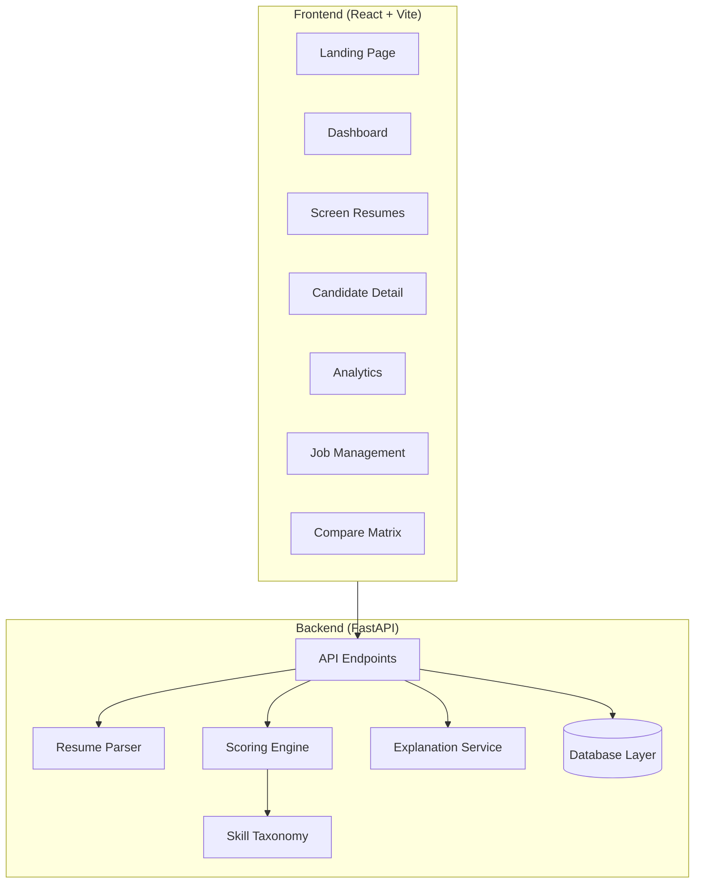

# Smart Resume Screener

A web application that parses PDF and TXT resumes, compares candidate profiles against job requirements using semantic text embeddings and multi-factor scoring, and generates structured candidate summaries, interview questions, and comparison reports.

[](https://python.org)
[](https://fastapi.tiangolo.com)
[](https://react.dev)
[](https://typescriptlang.org)
[](https://tailwindcss.com)
[](https://sqlite.org)

## Table of Contents

- [Features](#features)
- [Tech Stack](#tech-stack)
- [Architecture](#architecture)
- [Project Structure](#project-structure)
- [Getting Started](#getting-started)
- [Screening Engine](#screening-engine)
- [API Reference](#api-reference)
- [Configuration](#configuration)
- [Deployment](#deployment)
- [License](#license)
- [Author](#author)

## Features

### Resume Parsing and Matching
- Extracts text from uploaded PDF and TXT documents using PyMuPDF.
- Parses key sections including contact details, skills, education, work history, projects, and certifications.
- Normalizes skill variations using a curated taxonomy map.
- Calculates compatibility scores across seven distinct dimensions: skill overlap, semantic similarity, experience level, project relevance, education, certifications, and keyword presence.

### Candidate Evaluation
- Generates verified strengths, identified skill gaps, and suggestions for candidate resume improvement.
- Displays candidate competency profiles through interactive radar visualizations.
- Creates customized interview questions based on candidate-specific gaps and background.
- Generates structured recruiter outreach email drafts.

### Dashboard and Management
- Overview dashboard with key metrics, score distributions, and screening activity.
- Shortlist management to track preferred applicants.
- Side-by-side comparison matrix for evaluating multiple candidates simultaneously.
- Job description management with customizable required and preferred skills.

## Tech Stack

| Layer | Technology |
|---|---|
| Frontend | React 18, TypeScript, Vite, Tailwind CSS, Lucide Icons, Recharts |
| Backend | Python 3.10+, FastAPI, Uvicorn, SQLAlchemy Async, Pydantic v2 |
| NLP and Embeddings | Sentence-Transformers (all-MiniLM-L6-v2), Scikit-Learn, NumPy |
| Document Parsing | PyMuPDF |
| Database | SQLite (development) / PostgreSQL (production) |

## Architecture



## Project Structure

```
Resume-Screening-Website/
├── backend/
│   ├── app/
│   │   ├── ai/
│   │   │   ├── matcher.py
│   │   │   ├── llm_provider.py
│   │   │   └── prompts/
│   │   │       └── explanation.txt
│   │   ├── api/
│   │   │   ├── screen.py
│   │   │   ├── candidates.py
│   │   │   ├── jobs.py
│   │   │   ├── export.py
│   │   │   ├── health.py
│   │   │   └── dashboard.py
│   │   ├── core/
│   │   │   └── config.py
│   │   ├── database/
│   │   │   ├── models.py
│   │   │   └── session.py
│   │   ├── parsers/
│   │   │   ├── resume_parser.py
│   │   │   ├── job_parser.py
│   │   │   └── skill_taxonomy.py
│   │   ├── schemas/
│   │   │   └── schemas.py
│   │   └── main.py
│   ├── tests/
│   └── requirements.txt
├── frontend/
│   ├── src/
│   │   ├── api/
│   │   │   └── client.ts
│   │   ├── components/
│   │   ├── layouts/
│   │   ├── pages/
│   │   ├── types/
│   │   ├── App.tsx
│   │   └── main.tsx
│   ├── tailwind.config.js
│   ├── tsconfig.json
│   ├── vite.config.ts
│   └── package.json
├── docker-compose.yml
├── render.yaml
└── vercel.json
```

## Getting Started

### Prerequisites
- Python 3.10 or higher
- Node.js 18 or higher
- npm 9 or higher

### Backend Setup

```bash
cd backend
python -m venv venv
venv\Scripts\activate
pip install -r requirements.txt
uvicorn app.main:app --host 127.0.0.1 --port 8000 --reload
```

On Linux or macOS:
```bash
cd backend
python -m venv venv
source venv/bin/activate
pip install -r requirements.txt
uvicorn app.main:app --host 127.0.0.1 --port 8000 --reload
```

### Frontend Setup

```bash
cd frontend
npm install
npm run dev
```

The frontend will run at `http://localhost:5173` and the backend will run at `http://localhost:8000`.

## Screening Engine

The evaluation engine calculates composite scores using the following weight breakdown:

| Factor | Weight | Evaluation Method |
|---|---|---|
| Skill Match | 35% | Exact and normalized overlap with required and preferred skills |
| Semantic Fit | 25% | Cosine similarity between resume and job description embeddings |
| Experience | 15% | Years of relevant work history and job title alignment |
| Projects | 10% | Project descriptions and technical relevance |
| Education | 5% | Highest degree attained and field of study |
| Certifications | 5% | Industry recognized credentials |
| Keywords | 5% | Job description keyword density in resume body |

## API Reference

| Method | Endpoint | Description |
|---|---|---|
| POST | `/api/screen` | Upload resumes and screen against a job description |
| GET | `/api/candidates` | Retrieve candidate list with filtering and search |
| GET | `/api/candidates/{id}` | Detailed candidate profile and score breakdown |
| GET | `/api/candidates/{id}/interview-questions` | Generate interview questions |
| GET | `/api/candidates/{id}/outreach-email` | Generate candidate outreach email |
| POST | `/api/candidates/shortlist` | Toggle shortlist status |
| POST | `/api/candidates/compare` | Compare selected candidates |
| GET | `/api/jobs` | List job postings |
| POST | `/api/jobs` | Create a new job posting |
| DELETE | `/api/jobs/{id}` | Delete a job posting |
| GET | `/api/dashboard/stats` | Aggregated metrics for dashboard |

## Configuration

Set environment variables in `.env`:

```env
DATABASE_URL=sqlite+aiosqlite:///./sql_app.db
AI_PROVIDER=local
AI_API_KEY=
PORT=8000
HOST=0.0.0.0
CORS_ORIGINS=http://localhost:5173,http://localhost:3000
MAX_FILE_SIZE_MB=10
MAX_RESUMES_PER_BATCH=20
```

## Deployment

### Docker

```bash
docker-compose up --build -d
```

### Cloud Platforms
- Backend configuration is provided in `render.yaml` for Render.
- Frontend routing configuration is provided in `vercel.json` for Vercel.

## License

This project is open source and available under the MIT License.

## Author

Sai Praneeth Edupulapati
- GitHub: [@SaiPraneeth-E](https://github.com/SaiPraneeth-E)
- Email: edupulapatisairpaneeth12345@gmail.com
