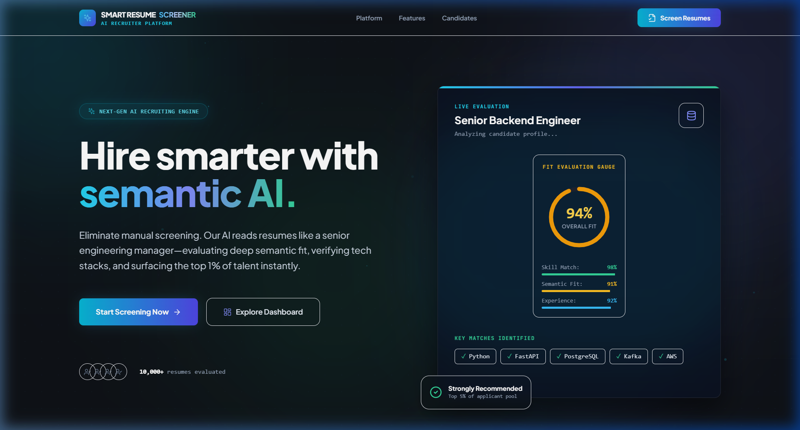
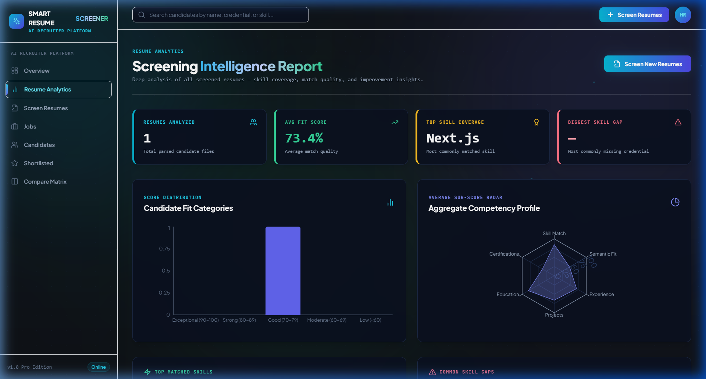
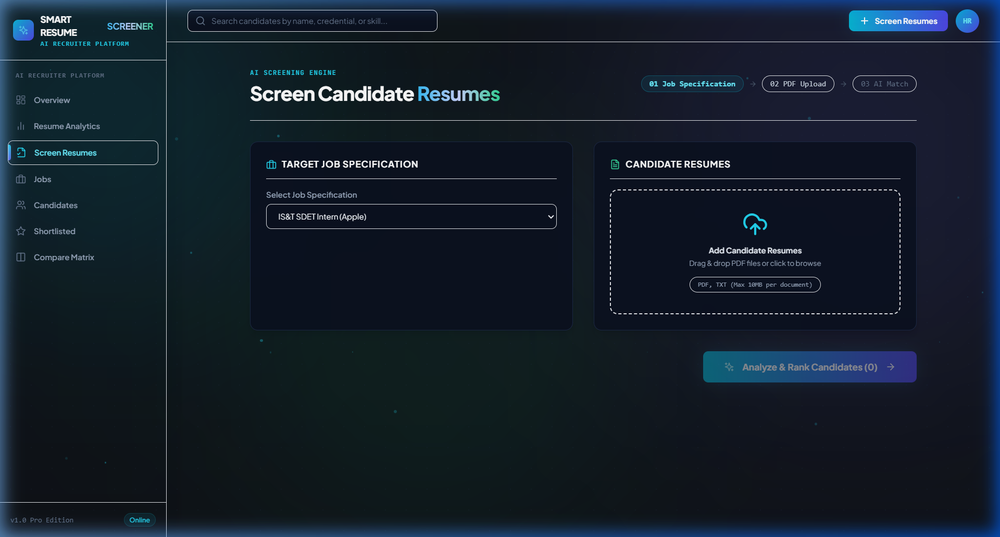

<div align="center">

# ✨ Smart Resume Screener — AI Recruiter Platform

### Intelligent Resume Screening & Candidate Evaluation System

[](https://python.org)
[](https://fastapi.tiangolo.com)
[](https://react.dev)
[](https://typescriptlang.org)
[](https://tailwindcss.com)
[](https://sqlite.org)

<br/>

> An end-to-end AI-powered resume screening web application that parses PDF/TXT resumes, matches them against job descriptions using **NLP semantic embeddings** and **hybrid scoring algorithms**, and provides detailed candidate analytics, gap analysis, interview kits, and recruiter outreach tools.

</div>

---

## 📋 Table of Contents

- [Features](#-features)
- [Tech Stack](#-tech-stack)
- [Architecture](#-architecture)
- [Project Structure](#-project-structure)
- [Getting Started](#-getting-started)
  - [Prerequisites](#prerequisites)
  - [Backend Setup](#1-backend-setup)
  - [Frontend Setup](#2-frontend-setup)
  - [Running the Application](#3-running-the-application)
- [How It Works](#-how-it-works)
- [API Reference](#-api-reference)
- [Screenshots](#-screenshots)
- [Environment Variables](#-environment-variables)
- [Deployment](#-deployment)
- [Contributing](#-contributing)
- [License](#-license)
- [Author](#-author)

---

## 🚀 Features

### Core Screening Engine
- **📄 PDF & TXT Resume Parsing** — Extracts text from uploaded resumes using PyMuPDF, then parses structured data (name, email, phone, skills, education, experience, projects, certifications)
- **🧠 Hybrid AI Matching** — Combines deterministic rule-based skill matching with semantic NLP embeddings (Sentence-Transformers) for deep resume-to-job-description similarity scoring
- **📊 7-Dimension Score Breakdown** — Skill Match, Semantic Fit, Experience, Projects, Education, Certifications, Keywords — each scored independently and weighted into an overall composite score
- **🤖 LLM-Powered Explanations** — Optional OpenAI GPT integration for human-readable fit justifications; falls back to a deterministic local AI provider when no API key is configured

### Candidate Intelligence
- **✅ Verified Strengths** — AI-generated list of candidate's proven competencies
- **❌ Identified Skill Gaps** — Missing required skills explicitly flagged
- **⚠️ Missing in Resume** — Credentials, metrics, or sections expected but absent (certifications, project details, etc.)
- **💡 Recommendations to Add** — Actionable suggestions for candidates to improve their resume for the role
- **📡 Radar Chart Analytics** — Visual 6-axis radar chart for each candidate's competency profile
- **🎯 Interview Kit Generator** — Auto-generated tailored interview questions based on skill gaps and strengths
- **📧 Outreach Email Drafter** — One-click recruiter email template generation for shortlisted candidates

### Platform Features
- **📈 Resume Analytics Dashboard** — Score distribution charts, skill coverage analysis, gap frequency, actionable insights
- **⭐ Shortlist Management** — Toggle candidates into a shortlist with persistent state
- **🔄 Compare Matrix** — Side-by-side comparison of 2–4 candidates across all scoring dimensions
- **💼 Job Management** — Create and manage job descriptions with auto-parsed required/preferred skills
- **🔍 Global Search** — Search candidates by name, email, skill, or credential
- **🌙 Dark Theme UI** — Premium glassmorphism dark mode with ambient background animations

---

## 🛠 Tech Stack

| Layer | Technology |
|-------|-----------|
| **Frontend** | React 18, TypeScript 5, Vite, Tailwind CSS 3.4, Framer Motion, Recharts, Lucide Icons |
| **Backend** | Python 3.10+, FastAPI, Uvicorn, SQLAlchemy 2.0 (async), Pydantic v2 |
| **AI/NLP** | Sentence-Transformers (`all-MiniLM-L6-v2`), NumPy, Scikit-Learn, OpenAI GPT (optional) |
| **Database** | SQLite (dev) / PostgreSQL (prod) via async SQLAlchemy |
| **PDF Parsing** | PyMuPDF (fitz) |
| **Deployment** | Docker, Docker Compose, Render, Vercel |

---

## 🏗 Architecture

```
┌─────────────────────────────────────────────────────────────────┐
│                        FRONTEND (React + Vite)                  │
│  ┌──────────┐ ┌──────────┐ ┌──────────┐ ┌──────────────────┐   │
│  │ Landing  │ │Dashboard │ │ Screen   │ │Candidate Detail  │   │
│  │  Page    │ │ Overview │ │ Resumes  │ │ (Radar, Tabs)    │   │
│  └──────────┘ └──────────┘ └──────────┘ └──────────────────┘   │
│  ┌──────────┐ ┌──────────┐ ┌──────────┐ ┌──────────────────┐   │
│  │Analytics │ │  Jobs    │ │Shortlist │ │ Compare Matrix   │   │
│  │  Page    │ │  Page    │ │  Page    │ │    Page          │   │
│  └──────────┘ └──────────┘ └──────────┘ └──────────────────┘   │
└────────────────────────┬────────────────────────────────────────┘
                         │ REST API (JSON)
                         ▼
┌─────────────────────────────────────────────────────────────────┐
│                     BACKEND (FastAPI + Uvicorn)                  │
│                                                                  │
│  ┌─────────────────────────────────────────────────────────┐    │
│  │                    API Layer (Routers)                    │    │
│  │  /api/screen  /api/candidates  /api/jobs  /api/dashboard │    │
│  └─────────────────────────┬───────────────────────────────┘    │
│                             │                                    │
│  ┌──────────────┐  ┌───────▼───────┐  ┌─────────────────────┐  │
│  │Resume Parser │  │ Hybrid Matcher│  │  LLM Provider       │  │
│  │  (PyMuPDF)   │  │(Embeddings +  │  │ (OpenAI / Local     │  │
│  │              │  │ Rule Engine)  │  │  Fallback)          │  │
│  └──────────────┘  └───────────────┘  └─────────────────────┘  │
│                                                                  │
│  ┌─────────────────────────────────────────────────────────┐    │
│  │              Database Layer (SQLAlchemy Async)            │    │
│  │  Jobs │ Candidates │ Resumes │ ScreeningResults │ Shortlists│
│  └─────────────────────────────────────────────────────────┘    │
└─────────────────────────────────────────────────────────────────┘
```

### Screening Pipeline Flow

```
Upload Resume (PDF/TXT)
        │
        ▼
  ┌─────────────┐
  │ Text Extract │  PyMuPDF extracts raw text from PDF bytes
  └──────┬──────┘
         ▼
  ┌─────────────┐
  │ Parse Resume│  Regex + heuristics extract name, email, skills,
  │             │  education, experience, projects, certifications
  └──────┬──────┘
         ▼
  ┌──────────────┐
  │ Skill Taxonomy│  160+ skill aliases normalized to canonical names
  │ Normalization │  (e.g., "js" → "JavaScript", "k8s" → "Kubernetes")
  └──────┬───────┘
         ▼
  ┌──────────────────┐
  │ Hybrid Match     │  7 sub-scores computed:
  │ Engine           │  • Skill Match (35%) — set intersection
  │                  │  • Semantic Fit (25%) — cosine similarity
  │                  │  • Experience (15%) — role count + title match
  │                  │  • Projects (10%) — tech overlap
  │                  │  • Education (5%) — degree detection
  │                  │  • Certifications (5%) — presence check
  │                  │  • Keywords (5%) — keyword coverage
  └──────┬───────────┘
         ▼
  ┌──────────────────┐
  │ AI Explanation   │  LLM generates: strengths, gaps,
  │ Generator        │  missing items, recommendations,
  │                  │  fit justification, experience alignment
  └──────┬───────────┘
         ▼
  ┌──────────────┐
  │ Save to DB   │  All scores, analysis, and parsed data persisted
  │ & Return JSON│  JSON response with full candidate match report
  └──────────────┘
```

---

## 📁 Project Structure

```
Resume-Screening-Website/
├── backend/
│   ├── app/
│   │   ├── ai/
│   │   │   ├── matcher.py              # Hybrid scoring engine (embeddings + rules)
│   │   │   ├── llm_provider.py         # LLM provider (OpenAI + local fallback)
│   │   │   └── prompts/
│   │   │       └── explanation.txt     # Prompt template for LLM fit analysis
│   │   ├── api/
│   │   │   ├── screen.py              # POST /api/screen — main screening endpoint
│   │   │   ├── candidates.py          # CRUD candidates, interview kit, outreach email
│   │   │   ├── jobs.py                # CRUD job descriptions
│   │   │   └── dashboard.py           # GET /api/dashboard/stats
│   │   ├── core/
│   │   │   └── config.py              # Pydantic settings (env vars)
│   │   ├── database/
│   │   │   ├── models.py              # SQLAlchemy ORM models
│   │   │   └── session.py             # Async DB session factory
│   │   ├── parsers/
│   │   │   ├── resume_parser.py       # PDF text extraction + structured parsing
│   │   │   ├── job_parser.py          # Job description parsing
│   │   │   └── skill_taxonomy.py      # 160+ skill alias normalization map
│   │   ├── schemas/
│   │   │   └── schemas.py             # Pydantic request/response schemas
│   │   └── main.py                    # FastAPI app entry point, CORS, static mount
│   ├── tests/
│   └── requirements.txt
├── frontend/
│   ├── src/
│   │   ├── api/
│   │   │   └── client.ts              # Typed API client (fetch wrapper)
│   │   ├── components/
│   │   │   ├── common/
│   │   │   │   ├── AmbientBackground.tsx  # Animated floating orbs background
│   │   │   │   ├── BrandLogo.tsx          # Brand logo component
│   │   │   │   ├── ScoreBadge.tsx         # Color-coded score display
│   │   │   │   └── SkillGroup.tsx         # Matched/missing/additional skills
│   │   │   └── graphics/
│   │   │       └── ScoreGaugeGraphic.tsx  # Landing page score gauge
│   │   ├── layouts/
│   │   │   └── DashboardLayout.tsx    # Sidebar + header shell layout
│   │   ├── pages/
│   │   │   ├── LandingPage.tsx        # Hero landing page
│   │   │   ├── DashboardPage.tsx      # Overview dashboard with KPI cards
│   │   │   ├── AnalyticsPage.tsx      # Resume analytics intelligence report
│   │   │   ├── ScreenPage.tsx         # Upload & screen resumes
│   │   │   ├── ResultsPage.tsx        # Candidate rankings list
│   │   │   ├── CandidateDetailPage.tsx # Full candidate dossier (6 tabs)
│   │   │   ├── ComparePage.tsx        # Side-by-side candidate comparison
│   │   │   ├── ShortlistedPage.tsx    # Shortlisted candidates view
│   │   │   └── JobsPage.tsx           # Job descriptions management
│   │   ├── types/
│   │   │   └── index.ts              # TypeScript interfaces
│   │   ├── App.tsx                    # React Router setup
│   │   ├── main.tsx                   # Vite entry point
│   │   └── index.css                  # Global styles + design system
│   ├── tailwind.config.js
│   ├── tsconfig.json
│   ├── vite.config.ts
│   └── package.json
├── docker/
├── docker-compose.yml
├── .env.example
├── render.yaml
├── vercel.json
└── README.md
```

---

## 🏁 Getting Started

### Prerequisites

| Tool | Version | Purpose |
|------|---------|---------|
| **Python** | 3.10+ | Backend runtime |
| **Node.js** | 18+ | Frontend build toolchain |
| **npm** | 9+ | Package manager |
| **Git** | 2.30+ | Version control |

### 1. Backend Setup

```bash
# Clone the repository
git clone https://github.com/SaiPraneeth-E/Resume-Screening-Website.git
cd Resume-Screening-Website

# Create Python virtual environment
cd backend
python -m venv venv

# Activate virtual environment
# Windows:
venv\Scripts\activate
# macOS/Linux:
source venv/bin/activate

# Install dependencies
pip install -r requirements.txt
```

### 2. Frontend Setup

```bash
# From the project root
cd frontend

# Install npm dependencies
npm install
```

### 3. Running the Application

#### Option A: Development Mode (Recommended)

**Terminal 1 — Start Backend:**
```bash
cd backend
uvicorn app.main:app --host 0.0.0.0 --port 8000 --reload
```

**Terminal 2 — Start Frontend Dev Server:**
```bash
cd frontend
npm run dev
```

Then open **http://localhost:5173** in your browser.

#### Option B: Production Build (Single Server)

```bash
# Build frontend into static files
cd frontend
npm run build

# The backend serves the built frontend automatically
cd ../backend
uvicorn app.main:app --host 0.0.0.0 --port 8000
```

Then open **http://localhost:8000** in your browser.

#### Option C: Docker Compose

```bash
docker-compose up --build
```

---

## ⚙️ How It Works

### 1. Resume Upload & Parsing
When you upload a PDF or TXT resume, the backend:
- Extracts raw text using **PyMuPDF** (for PDFs) or direct UTF-8 decoding (for TXT)
- Uses regex heuristics to extract: **Name**, **Email**, **Phone**, **Location**, **LinkedIn**, **GitHub**, **Portfolio URL**
- Segments the resume into sections (Summary, Skills, Experience, Education, Projects, Certifications, Achievements) using header pattern matching
- Normalizes extracted skills against a **160+ skill alias taxonomy** (e.g., `"k8s"` → `"Kubernetes"`, `"py"` → `"Python"`)

### 2. Hybrid AI Matching
The scoring engine computes **7 independent sub-scores**:

| Sub-Score | Weight | Method |
|-----------|--------|--------|
| Skill Match | 35% | Set intersection of candidate skills vs. required + preferred |
| Semantic Fit | 25% | Cosine similarity between resume & job description embeddings (`all-MiniLM-L6-v2`) |
| Experience | 15% | Number of roles + job title match detection |
| Projects | 10% | Presence of projects + technology overlap with job requirements |
| Education | 5% | Degree type detection (Master's > Bachelor's > Other) |
| Certifications | 5% | Presence of any industry certifications |
| Keywords | 5% | Overlap with job description keywords |

### 3. AI Explanation Generation
After scoring, the AI provider generates:
- **Fit Rating** (1-10 scale)
- **Strengths** — Verified capabilities backed by resume data
- **Skill Gaps** — Required skills missing from the resume
- **Missing in Resume** — Expected sections, metrics, or credentials absent
- **Recommendations** — Actionable suggestions to improve resume fit
- **Experience Alignment** — How work history maps to the role

### 4. Candidate Detail Dossier
Each screened candidate gets a full profile with **6 tabs**:
1. **Analytics & Radar** — Radar chart + score breakdown + strengths/gaps/missing/recommendations
2. **Skills Evaluation** — Matched, missing, and additional skills visualized
3. **Experience & Credentials** — Work history timeline + education
4. **Fit Assessment** — Detailed match explanation + experience alignment
5. **Interview Kit** — 5 auto-generated questions (skill-gap probing + technical deep-dive + behavioral)
6. **Parsed Resume JSON** — Raw structured data extracted from the resume

---

## 📡 API Reference

| Method | Endpoint | Description |
|--------|----------|-------------|
| `POST` | `/api/screen` | Screen resumes against a job (multipart form: files + job_description) |
| `GET` | `/api/candidates` | List all candidates with filters (search, min_score, session_id) |
| `GET` | `/api/candidates/{id}` | Full candidate detail with parsed resume + screening analysis |
| `GET` | `/api/candidates/{id}/interview-questions` | Generate tailored interview kit |
| `GET` | `/api/candidates/{id}/outreach-email` | Generate recruiter outreach email draft |
| `POST` | `/api/candidates/shortlist` | Toggle candidate shortlist status |
| `POST` | `/api/candidates/compare` | Compare 2-4 candidates side-by-side |
| `GET` | `/api/jobs` | List all job descriptions |
| `POST` | `/api/jobs` | Create a new job description |
| `DELETE` | `/api/jobs/{id}` | Delete a job description |
| `GET` | `/api/dashboard/stats` | Aggregated dashboard statistics |

---

## 🖼 Screenshots

### Landing Page
Premium dark theme landing page with animated background orbs and feature highlights.


### Dashboard Overview
KPI summary cards (Total Screened, Avg Score, Shortlisted, Jobs Analyzed) + Score distribution chart + Skill gap analysis + Screening history table.

### Resume Analytics
Dedicated analytics intelligence report with score distribution, radar chart, skill coverage bars, gap frequency analysis, and actionable insights.


### Screen Resumes
Upload multiple PDF/TXT resumes, select or create a job description, and get instant AI-powered match results.


### Candidate Detail
Full candidate dossier with radar chart, 7-dimension score breakdown, strengths, gaps, missing resume items, recommendations, interview kit, and outreach email generator.

---

## 🔐 Environment Variables

Create a `.env` file in the project root (copy from `.env.example`):

```env
# Database (SQLite for local dev, PostgreSQL for production)
DATABASE_URL=sqlite+aiosqlite:///./sql_app.db

# AI Provider ("openai" or "local")
# Set to "openai" and provide API key for GPT-powered explanations
# Set to "local" for deterministic fallback (no API key needed)
AI_PROVIDER=local
AI_API_KEY=sk-your-openai-api-key-here

# Server
PORT=8000
HOST=0.0.0.0
CORS_ORIGINS=http://localhost:5173,http://localhost:3000

# Limits
MAX_FILE_SIZE_MB=10
MAX_RESUMES_PER_BATCH=20
```

---

## 🚢 Deployment

### Render (Backend)
The project includes a `render.yaml` for one-click deployment to Render.

### Vercel (Frontend)
The project includes a `vercel.json` for deploying the frontend to Vercel.

### Docker
```bash
docker-compose up --build -d
```

---

## 🤝 Contributing

Contributions are welcome! Please follow these steps:

1. Fork the repository
2. Create a feature branch (`git checkout -b feature/amazing-feature`)
3. Commit your changes (`git commit -m 'Add amazing feature'`)
4. Push to the branch (`git push origin feature/amazing-feature`)
5. Open a Pull Request

---

## 📄 License

This project is open source and available under the [MIT License](LICENSE).

---

## 👨‍💻 Author

**Sai Praneeth Edupulapati**

- GitHub: [@SaiPraneeth-E](https://github.com/SaiPraneeth-E)
- Email: edupulapatisairpaneeth12345@gmail.com

---

<div align="center">

**Built with ❤️ using FastAPI, React, and AI**

⭐ Star this repository if you found it useful!

</div>
